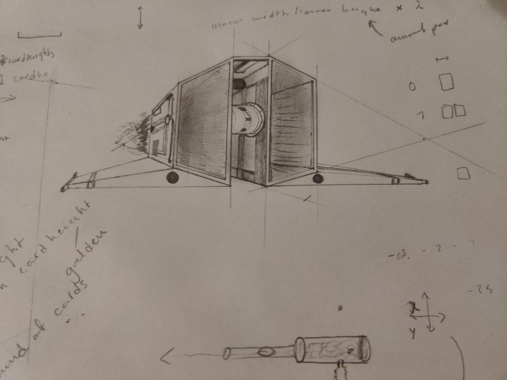

# BLENDER SPEEDRUN

Drew some perspective drawing 2 days ago, wanted to see how it 							would look in Blender. Then spent the next day on learning how to 							use the application. Really intuitive, got a good grasp thanks to 							this fellow on YouTube: Imphenzia. I then decided to see if I 							could preview it on a github page I had recently created (This 							one). After a solid day of work my shitty 3D model is viewable on 							a website from anywhere around the world!

