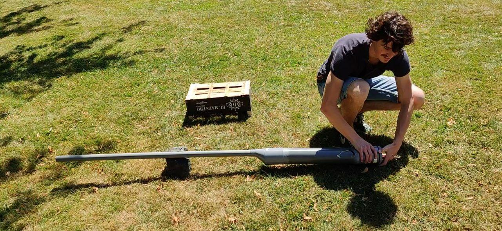

# [DARPA POTATO GUN](https://www.youtube.com/watch?v=J2pw6YUc0-Q)

Bored on a saturday morning with Charles and Come, we decide that 							it is time we made a potato gun. Ingredients: Potato, PVC and 							lighter. Surprisingly powerful, especially given that less fuel 							gives a more potent explosion (Ratio of Oxygen?)

