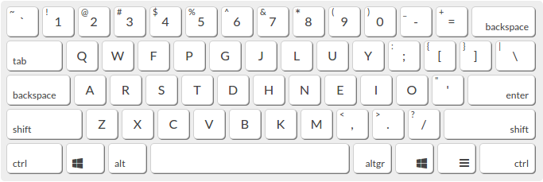

# [TYPING SPEED](https://www.keybr.com/profile/61pc4tj)

After reseting my computer because I had accidentaly corrupted my 							Ubuntu, I was presented with the option to select a keyboard 							layout. I decided to go with Colemak, which had been specificaly 							designed to be more efficient at typing compared to Qwerty. Over 							the course of 2 weeks I went from 0 wpm to 50! I am currenty 							working on punctuation and coding, as those also rely on muscle 							memory. 						

