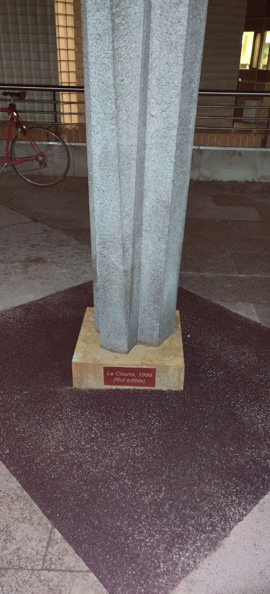

# LE CHURROS

EPFL decided to install this weird ass sculpture on the 							diagonale, a popular walkway. Seeing as there was no name on it, 							with the inspiration of a friend we decided to baptise it Le 							churros, 1999, (Not edible) The actual name of the structure is 							Beton, made in the 70s.

