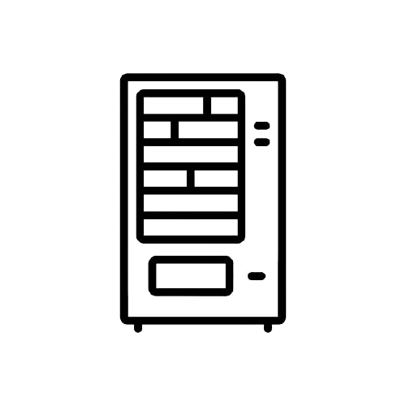
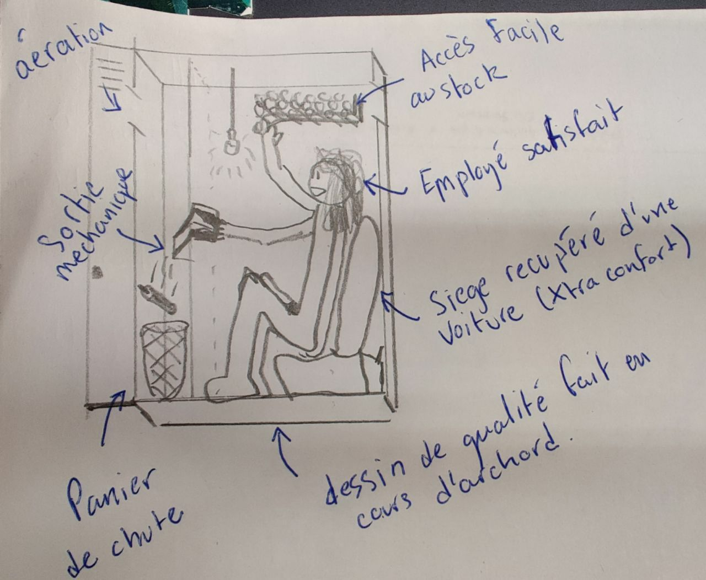

# [AUTOMATÉ](images/Projet de casier distributeur automatique de Mate.pd)

Lors d'un cours d'archord, avec Elior on a eu l'idee fantastique 							de creer une machine qui automatiserais la vente de club mates, 							des boissons remplies de caffeine. Apres quelques dessins de 							design, nous avons commencee a construire la boite dans laquelle 							une personne se mettrais et donnerait un mate a ceux qui vennait 							appuyer sur un bouton. Malheureusement le projet ne s'est jamais 							acheve.

