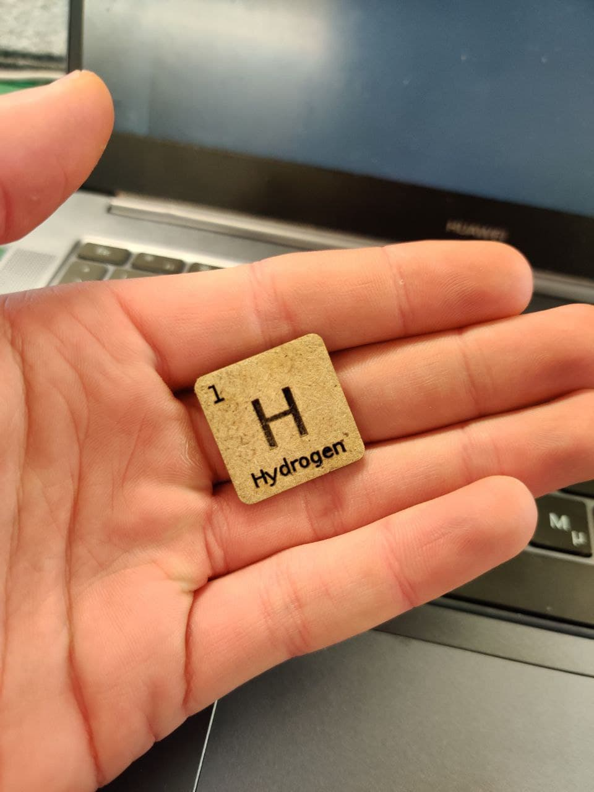

# [WOODEN ELEMENTS](https://github.com/TugdualKerjan/WoodenElements)

I absolutely love chemistry, and thus I decided it would be 							awesome to laser cut some periodic table of elements with a 							collectable like feeling to them (Basically make them look cute). 							To acheive this I used a multitude of programs and loopholes so as 							to automatise the process of editing each name. I started by 							downloading a csv with all the elements and their numbers, then 							designing the basic template token in inkscape, then using a 							python program to copy paste and change the number, symbol and 							name and paste the elements one next to another. I then transform 							it using SVG to DXF 						

