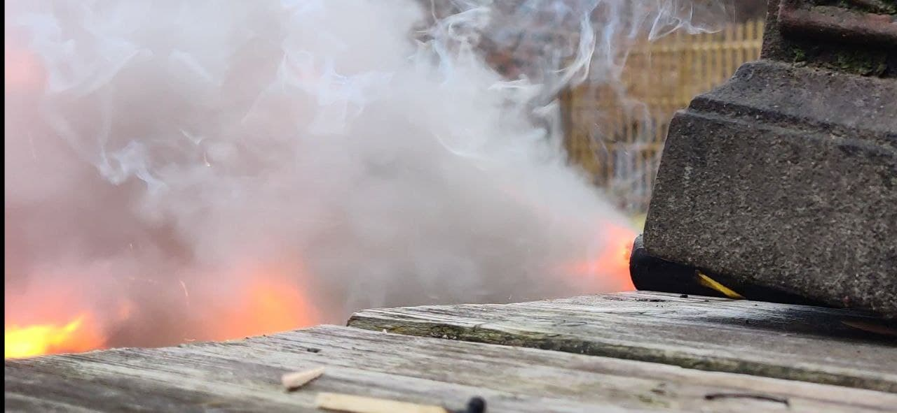

# [SUGAR ROCKETS](https://youtu.be/7CMFNPTSn-w)

Once again bored during quarantine and having completed the DARPA 							Potato Canon, I wanted to go a little further. The obvious answer 							is building rockets, so after a little research and the 							wonderfully documented blog of Richard Nakka, I decided to go for 							the classic potassium nitrate (KNO3) + sugar rockets. Just like 							your car, your rocket needs oxygen and a fuel. Instead of using 							petrol we will use sugar, and instead of using the oxygen of the 							atmosphere we will grab them from the potassium nitrate. We 							grabbed some sodium nitrate from the gardening store and some 							potassium chloride from the pharmacy (A common replacement for 							salt). Did a double displacement reaction and ended up with our 							long awaited for potassium nitrate. Some tests reveal flamboyant 							success, and, don't tell mom but when mixing another batch later 							on it exploded and my hair burt to a crisp. Thankfully I was 							wearing goggles and a mask, so my moustache is intact.

