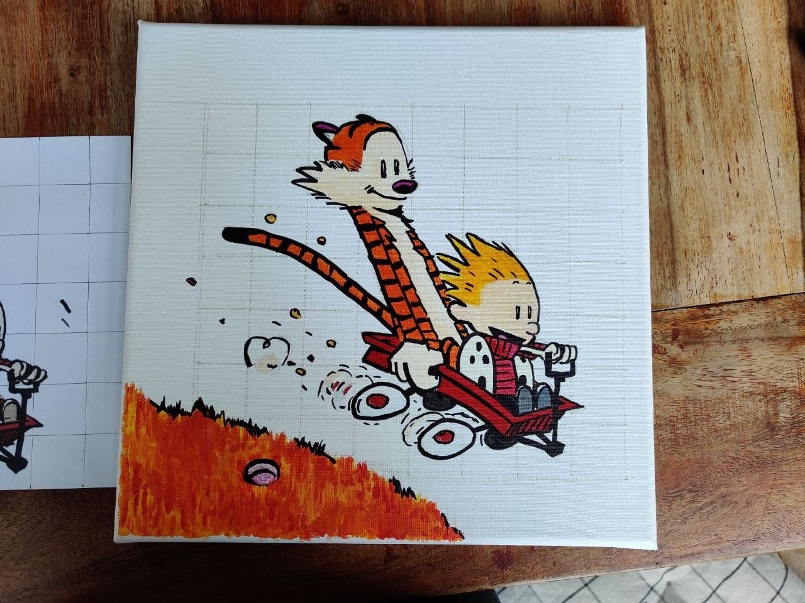

# [CALVIN AND HOBBES](https://github.com/TugdualKerjan/CalvinAndHobbesPainting)

On a whim when back from EPFL to vacation for Easter with the 							family I asked my Mom if she could teach me how to paint. I had 							already painted, but a long time ago and I feel like I have a sort 							of helplessness associated with just not knowing where to start 							for things a simple as painting. This also applies in Sowing, 							Woodworking, Car reperations and, probably forever seeing as how 							complex the field is, Computer Science.

