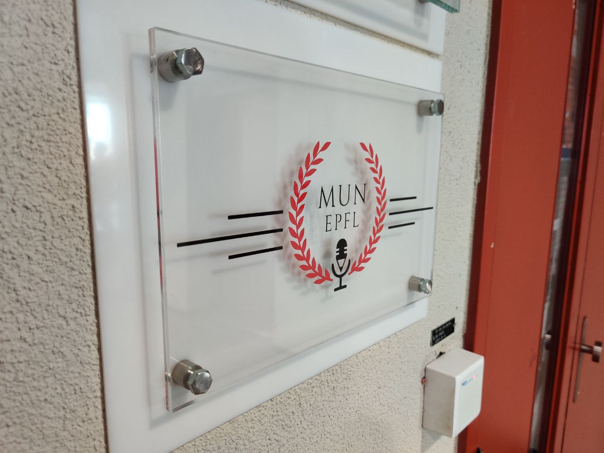

# MUN SIGN

During the vacation of 2019 I used the SKIL to create a new Sign Plate for MUN, in our entrance of our headquarters CO116 it is composed of two PMMA, one white for the background and a transparent one with a combination of a black and red vinyl stickers cut out with a Silhouette 3. 

