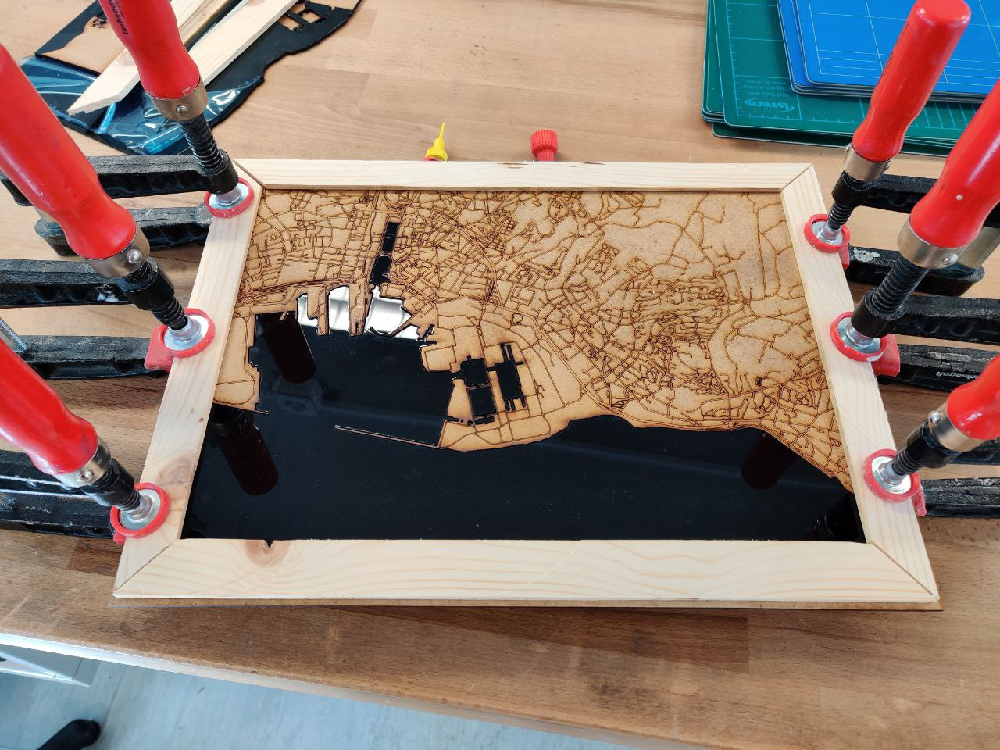

# CADRE

Both of my grandparents live near the sea. Using 3mm medium density fiberboard and some tinted black plexiglass I decided to make them some maps of their area. I used <a href="https://snazzymaps.com">snazzymaps.com</a> to create a black and white theme of their cities with the roads. One of the frames was done with wood from a waste disposal and the other adapted from an old frame to fit the map.

