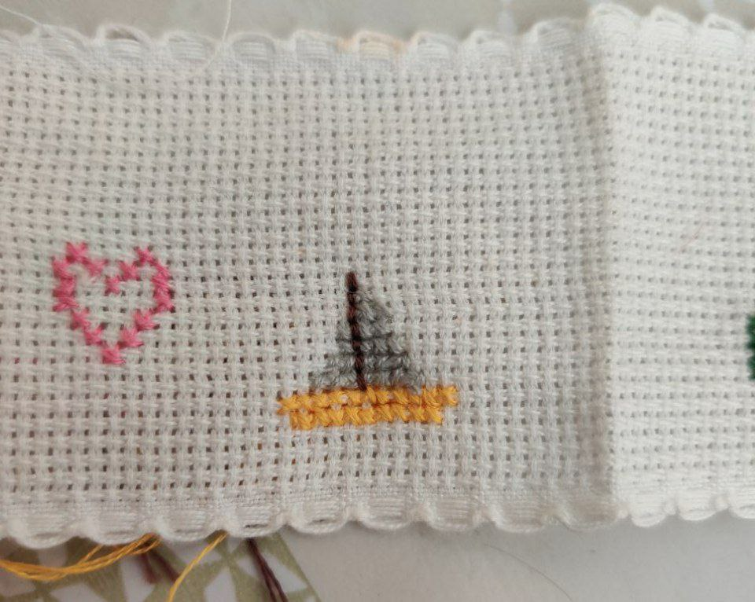

# BRODERIE

Decided to learn to sow on the most basic level, asked grandma for some help to make some little patterns using 3 different colors of string. With the help of aida cloth which allows easy cross-stitch embroidery. Was a great experience. Mom came to give us extra tips and tricks on being more efficient when making lines of cross-stitches.

