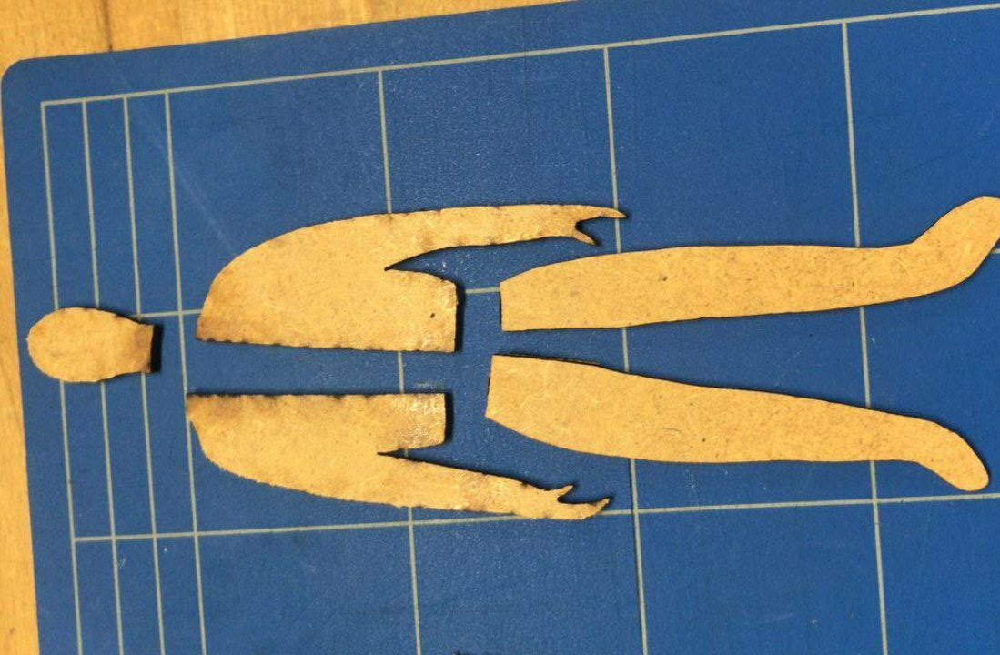

# MALEVICH

Mom and Foulques came to EPFL for a few days. She loves art, and one of the goals in her classroom is to make the kids interact more with different creations of artists. Before, I had already created a frame based of Mondrian, now this time the goal was to make humans based off the art of Kazimir Malevich. Mom drew the outline, then we vectorized the picture and adjusted the fine details by editing the nodes of the outline. Result: 16 humans to play with.

