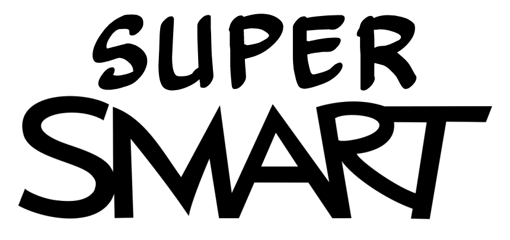
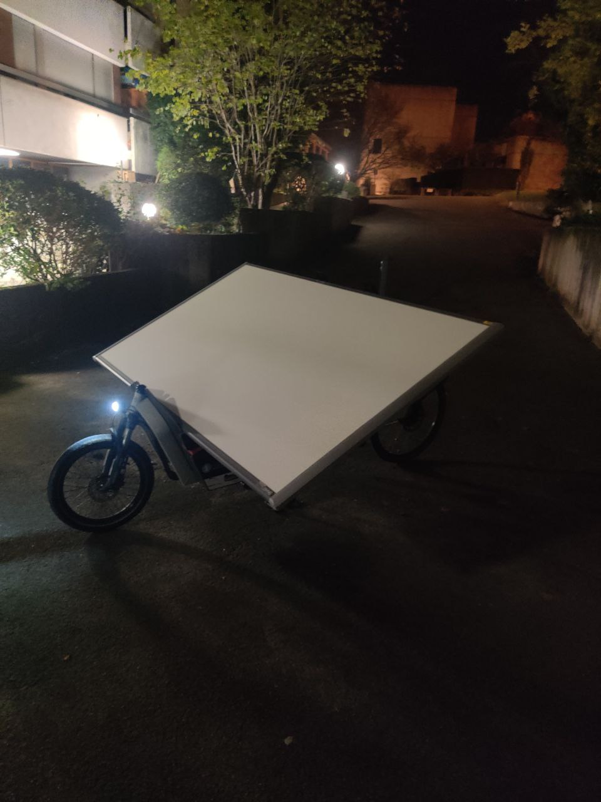

# SUPERBoard

Lors d'une fin de soirée nous sommes tombées sur des SMARTBoards aux encombrants avec Olivier. Un peu de motivation et quelques grammes m'aident à le ramener à la maison. Il s'avère que c'est un trackpad, je peux donc définir diverses actions selon des zones différentes du tableau. Par exemple, créer un clavier pour inciter l'impression d'étiquettes marrantes, interfacé avec une RaspberryPi entre le SMARTBoard et l'étiqueteuse Brother (Reuf)

