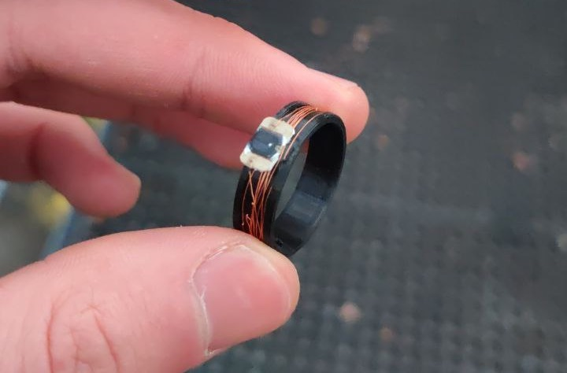

# NFC RING

Pendant les vacances de février, j'ai tenté de transformer ma carte d'accès au campus de l'EPFL en annaux que je pouvais porter sur mon doigt. La carte est fait de PCB et se dissout à l'acetone pour ne laisser que le fil qui sert de transceiver et d'inducteur afin d'alimenter une petite puce caché au sein de la carte. Après quelques essais, je suis capable de maintenant ouvrir comme avec une carte normale les portes des batiments, payer et utiliser les imprimantes ! Le fil reste très fragile, j'aimerais fabriquer une version plus solide et capable d'être détécté de plus loin.

