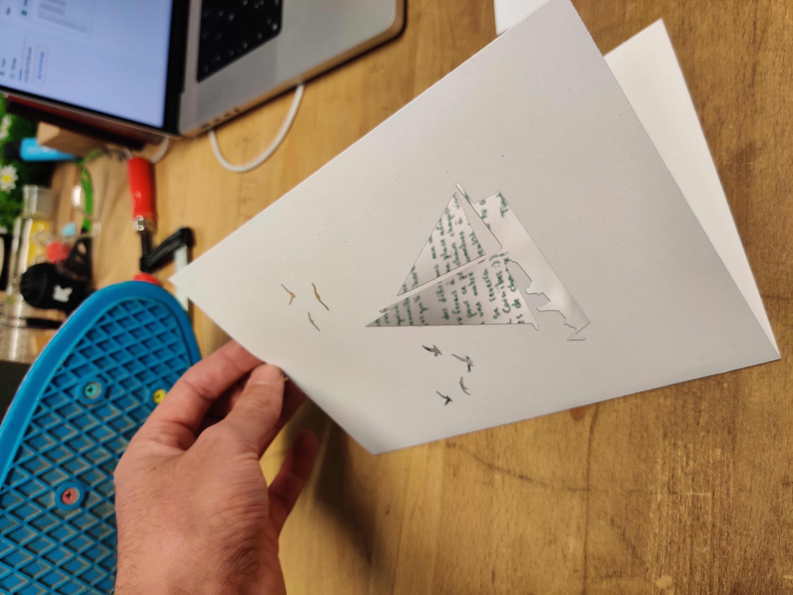

# LETTRE

Un bon ami à moi part en voyage pendant un an sur un batô. Je j'apprécie énormément et j'ai décidé de lui écrire une lettre afin qu'il le sache ! Papier 300g/m2 trouvé dans une partagère et image de bateau et oiseau trouvé en ligne, je l'ai laser découpé afin de créer une découpure puis mis dans un autre papier jaune comme enveloppe en vitesse. 

