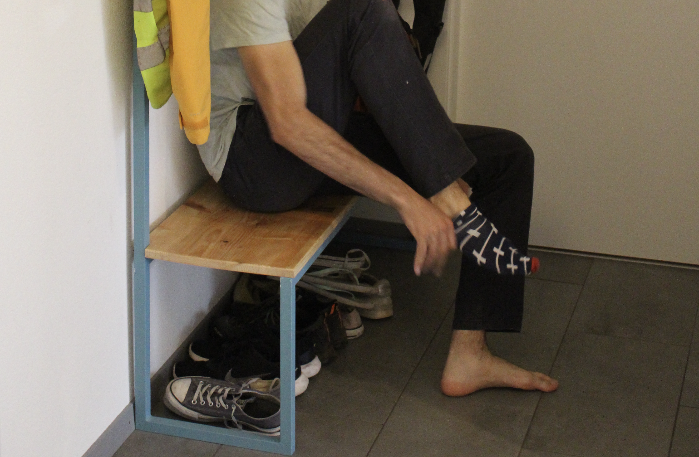

# BANC

We wanted to get a bench for the house as there isn't really a place to put the shoes and coats back in the apartment. I thought it would be a great excuse to try learning to weld as the design we chose was only right angle welds. Bought some steel, cut it up after having modelled it on Fusion360 and then learned to weld ! Six hours later and after a lot of learning, I got a bench ! Now we learned what primer is for after seeing rust appear during the painting process, so we had to do a second round. Finally, some time later I found a good piece of wood to sand down and luster up to place on the steel, completing this great learning experience ! We can finally put our socks on while sitting down 🎉.

