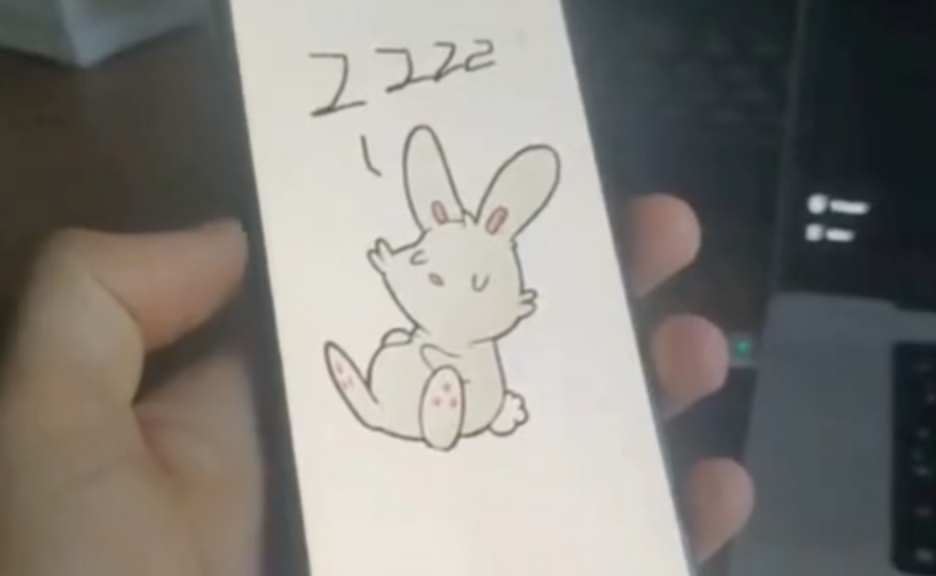

# [BUNNY](https://github.com/TugdualKerjan/bunny)

Bunny is a better worse version of Rabbit R1, an AI assistant supposed to facilitate the interface between humans and LLMs. This project is a proof of concept to show the potential in reusing old phones as cheap, portable and privacy oriented devices that won't send your chats to be trained at OpenAI or whatever other company. It will work without any connection and can be further configured to your desire. Further down the road, I would want to have the skills to run the computationally intensive parts on dedicated hardware to accelerate and render more efficient the inference.

