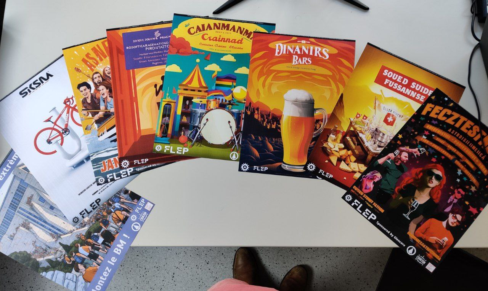

# POSTERS

I like playing around with the idea of "s'approprier l'espace", which seems to lack translation in english but it's basically making public spaces feel more human, at home, welcoming... Around a year ago EPFL removed certain spots used to display club posters to "clean things up". This had the issue that any club reusing these once used and now "clean" spots would get reprimanded as it would be the only one doing it. The solution was to create fake posters that would drown out the responsibility of a single club as was the case before. I used Midjourney to create a set of posters that were then printed and placed in these various old spots, making it easier for others to start doing the same ! :)

