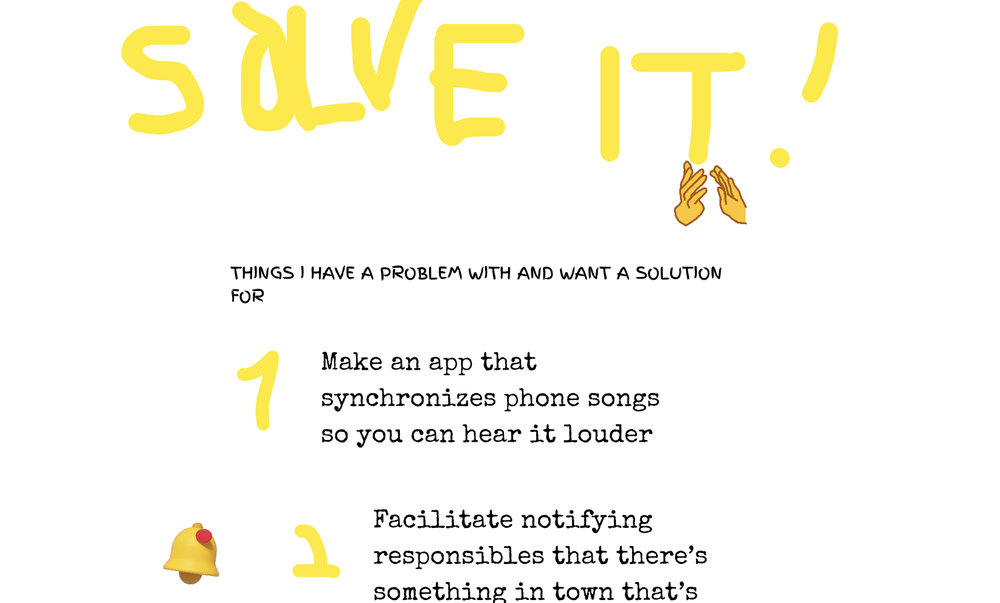

# [SOLVEIT](https://tugdual.fr/solveit/)

Sometimes when I try to go to sleep I think about a problem / solution that I would love to see pop up in the world. Ideas are good but execution is what counts. Thus I'm writing them down and making a public link so that more people may see and be motivated to implement a solution for it. It was also an excuse to make a page using mmm.page, which is legit gold concerning making things fast and dirty, just copied the HTML source and plopped it in my own site and it works ! :)

