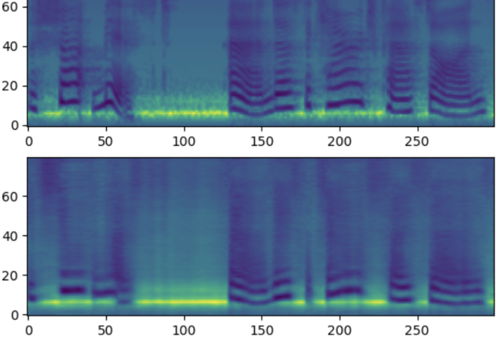

# [VQVAE in JAX](https://github.com/TugdualKerjan/audio-vae-jax)

Je deviens corpo. I'm currently in Dakar working on my master's thesis and I want to share what I do so that the next Tugdual who comes along doesn't have to spend 5 days from sunrise to sunset figuring out why his cute VQVAE seems smart enough to freeze boiling water for later use. (The problem is actually between the chair and the computer but hey). Anyways. Less fun than other projects but a project nonetheless.

