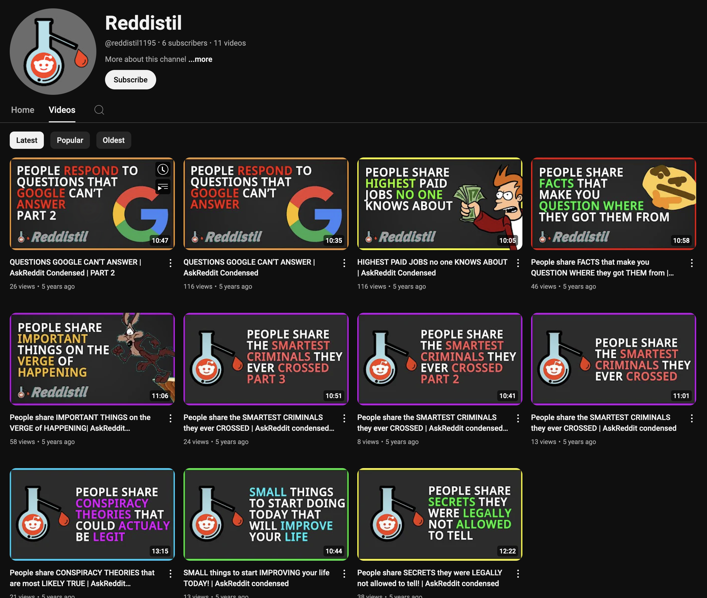

# [REDDISTIL](https://www.youtube.com/@reddistil1195/videos)

Back 5 years ago, videos doing Text to Speech on the most popular reddit threads in certain subreddits like "Ask me Anything" and "TIL" were popping up and making tons of views. I thought it would be pretty easy to automate these and so made my own and posted a few videos on youtube with it. Unfortunately I think I didn't persevere enough to break through and lost the code with time. Good memories anyways :)

