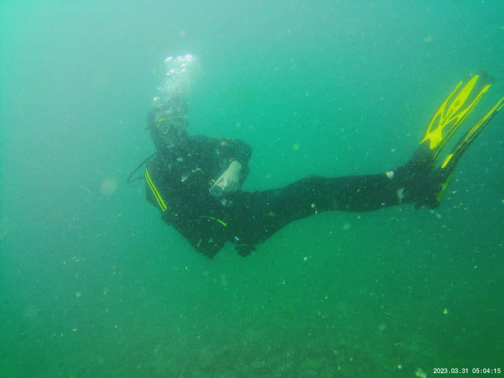

# DIVING

Finishing off my time at Dakar I was looking to spend some time learning a new skill - Dakar is surrounded by the sea and although not the most beautiful place to dive it had facilities to take classes and obtain at least the preliminary license ! Even in Senegal the water temperature was around 15-16 degrees ! After 9 dives through SSI (Scuba schools international) I obtained my Open Water Diver and can now dive up to 18m :)

