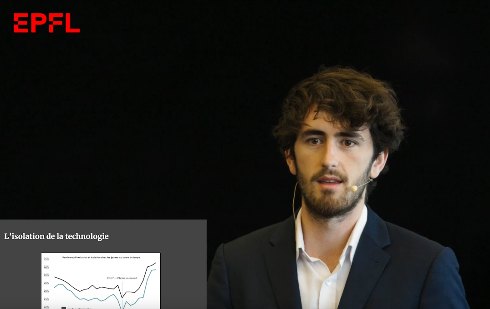

# [TED TALK](https://www.youtube.com/watch?v=u_bXXss8xh4)

In 2023 I was asked to give a TEDx talk on the subject linked to technology, and thus I presented through the lens of using tech for good my bachelors project, which used computer vision to automatically segment (cut out) and classify stickers in images. <a href="https://github.com/TugdualKerjan/StickerDetection">More on this here</a>. The talk mainly addresses the fact that technology is a tool, and tools can be used for good or bad. Currently, social networks mainly exploit Machine Learning, a technology, to grab more of our attention and sell us more ads. I wanted to show through the game I created where, similar to Pokemon Go, people run around outside finding stickers, that ML can be used for for fun and to incite people to socialize rather than sit behind a screen.

