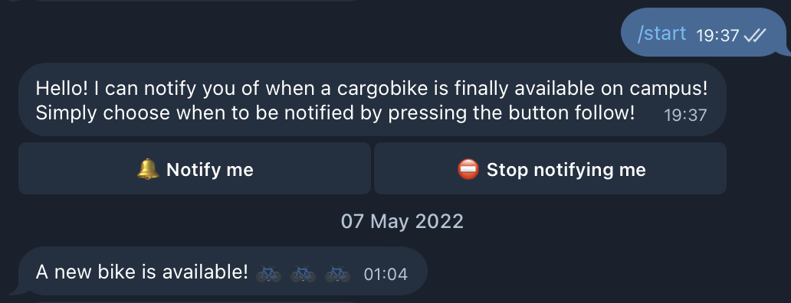

# CARGOBIKE BOT

At EPFL we have the ability to pick up a cargobike through the bike sharing app donkey republic for 12h without paying. It's a fantastic service that is provided free of charge by the school and has been the source of a lot of memories for me and friends alike. Unfortunately, there was a lot of demand and few bikes, thus if you wanted to reserve a bike you had to constantly check the app. A simple telegram bot on my end solves this issue - at the press of a button I could receive a notification whenever a cargobike was available again. 

