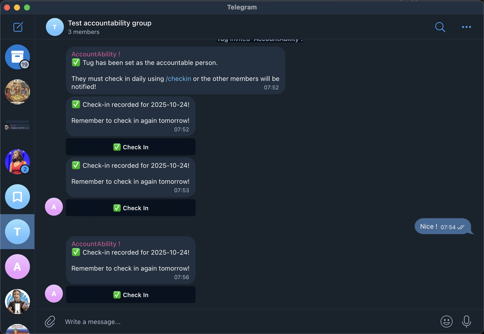

# [Accountability Bot](https://github.com/TugdualKerjan/AccountAbility)

I've played around with trying to build certain habits (running, morning routines...). One thing that I've noticed really works nicely is being accountable to someone else. Unfortunately, without the other person asking regularly this accountability can quickly fizzle out. To help with staying on track, I built a telegram bot that will ping the other people on a group if a certain user hasn't checked in for the day concerning a task ! I'll be back in a bit to see if it worked on me :)

